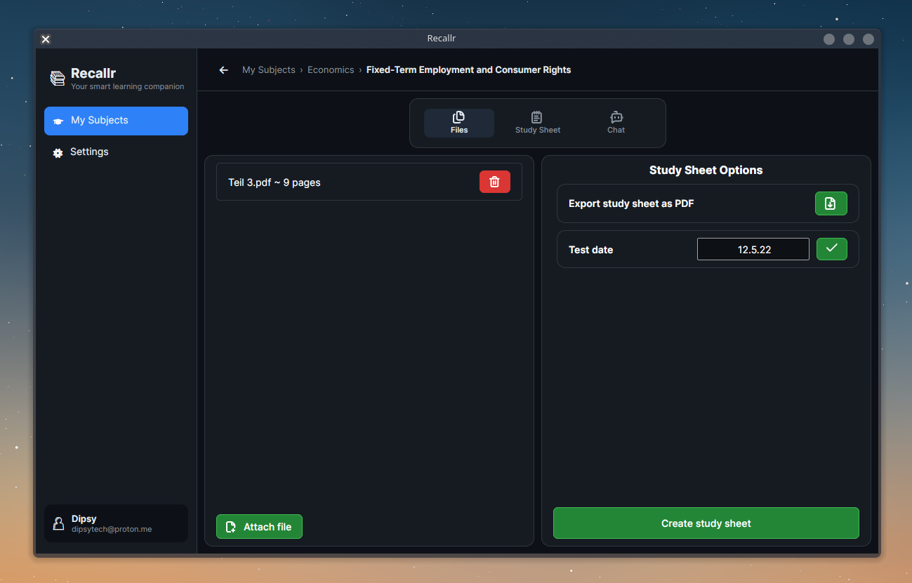

# Recallr


Recallr — turn photos and PDFs into compact study sheets and AI-generated quizzes to practise active recall.

---

## Table of Contents

- [What is Recallr?](#what-is-recallr)
- [Screenshots](#screenshots)
- [Key Implemented Features](#key-implemented-features)
- [Planned / Upcoming Features](#planned--upcoming-features)
- [Architecture & Tech Stack](#architecture--tech-stack)
- [Setup / Build](#setup--build)
- [Running the App / Quick Usage](#running-the-app--quick-usage)
- [Contributing](#contributing)
- [Changelog](#changelog)
- [License](#license)

---

## What is Recallr?

Recallr converts user-uploaded photos and PDFs into structured learn sheets using an OpenAI-powered pipeline and can generate interactive AI quizzes (chat-style) from that content so users can test and reinforce their knowledge.

Typical workflow:
- Upload photos / PDFs of notes or slides
- Generate a learn sheet (AI summarizes and formats content)
- Start an AI-powered chat/quiz to test knowledge based on the learn sheet

---

## Screenshots

|                       Learn Sheet                       |                     Learn Sheet View                      |
|:-------------------------------------------------------:|:-------------------------------------------------------:|
|  |  |

|                       Learn Sheet Chat                       |                      Settings View                       |
|:-------------------------------------------------------------:|:-------------------------------------------------------:|
|      |     |

## Key Implemented Features
- 🤖 **AI-Powered Summaries** – automatically generate learn sheets from your uploaded files
- 💬 **Interactive AI Chat & Quizzes** – ask questions and get quizzed on your material with streaming responses
- 🎯 **Multiple-Choice Quiz Picker** – clickable answer options instead of typing
- 📄 **File Import** – import images (PNG, JPG, WEBP) and PDFs as source material
- 📚 **Course & Learn Sheet Management** – organize your subjects and generated study sheets
- 🌐 **Multi-Language Support** – German & English
- 🔒 **Encrypted API Key Storage** – your OpenAI key is encrypted at rest via `Microsoft.AspNetCore.DataProtection`
- ⚙️ **Customizable AI Behavior** – choose OpenAI model, summary style and quiz difficulty
- 🎨 **Light/Dark Theme** – Fluent UI-based theming

Notes from code:
- Settings and courses are stored as plain JSON files in the user's ApplicationData folder (the OpenAI key itself is encrypted before being written; everything else is stored as-is).

---

## Planned / Upcoming Features

Planned items (not yet implemented in code):
- Knowledge status view for learn sheets (tracking how well the user knows each topic)
- Adjustable font size for the learn sheet view (UI control to change font rendering)
- General AI Chat for school related assistance (Featuring: File Upload & Websearch Features)
- Calendar for class tests & pop quizes

---

## Architecture & Tech Stack

- UI: Avalonia (MVVM pattern)
- Language / Runtime: C# / .NET 10
- MVVM: CommunityToolkit.Mvvm
- AI: OpenAI .NET SDK (OpenAI.Chat integration)
- Markdown rendering: Markdown.Avalonia
- PDF handling: PDFsharp
- Charts: LiveChartsCore
- DI: Microsoft.Extensions.DependencyInjection (basic service registration)

Code layout highlights:
- App startup: `Program.cs` (creates `%APPDATA%/Recallr/Config` files if missing)
- Views: `/Views` (CourseView, LearningsheetView, LearningsheetDetailedView, SettingsView)
- ViewModels: `/ViewModels` (MainViewModel, CourseViewModel, LearningsheetDetailedViewModel, SettingsViewModel)
- Services: `/Models/Services` (AIService, SettingsService, CoursesService, ChatStorageService, FilePickerService, PdfService)
- Models: `/Models/Configuration` and `/Models/Models`

---

## Setup / Build

Prerequisites:
- .NET 10 SDK (or newer)

**Supported platforms:** Windows and Linux are actively tested. macOS is not currently tested and may not work out of the box (untested, not officially supported yet).

Restore and run locally:

```bash
# from repository root
dotnet restore
dotnet build
dotnet run --project Recallr.csproj
```

Notes:
- The project references packages in the .csproj (Avalonia 12.1.0, OpenAI 2.12.0, Markdown.Avalonia, LiveChartsCore, PDFsharp, CommunityToolkit.Mvvm).
- No extra database required — the app stores JSON files under the OS ApplicationData folder (see `FileSystemPaths` in source).

---

## Running the App / Quick Usage

1. Launch the app (`dotnet run` or your platform-specific build).
2. Open settings and paste your OpenAI API key into the key field, set profile name/email and preferred theme.
   - The key is encrypted before being saved to `%APPDATA%/Recallr/Config/ClientSettings.json`.
3. Create a course and open it.
4. Create a learn sheet and use the file picker to add files.
5. Click "Create study sheet" to generate the summary. The generated text is saved as `learnsheet.md` in the learn sheet folder.
6. Open the learn sheet chat to start AI-powered quizzes / active-recall practice. Chat is streamed and saved to per-learn-sheet JSON logs.

Paths used by the app (OS-dependent):
- Settings: `%APPDATA%/Recallr/Config/ClientSettings.json`
- Courses: `%APPDATA%/Recallr/Config/ClientCourses.json`
- Course files: `%APPDATA%/Recallr/Courses/{courseId}/{learnsheetId}/`
- Chat logs: `%APPDATA%/Recallr/ChatLogs/{courseId}/{learnsheetId}.json`

---

## Contributing

This project is in early, active development (v0.3.0). Contributions, bug reports and feedback are welcome — open an issue or submit a pull request. Prefer small, focused PRs and describe breaking changes clearly.

Before contributing:
- Run `dotnet restore` and ensure the app builds locally.
- If changing settings storage or secrets handling, include migration notes.

---

## Changelog

See [CHANGELOG.md](CHANGELOG.md) for the full version history.

---

## License

This repository includes a LICENSE file: MIT License. See [LICENSE](LICENSE) for details.

---

If anything in this README is unclear or you'd like it adjusted (language, example screenshots, additional sections), say which parts to expand and a preferred tone (concise, tutorial, or marketing).