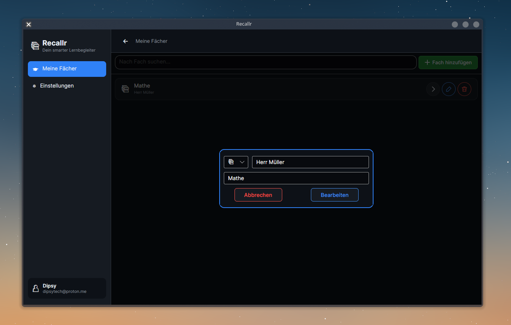
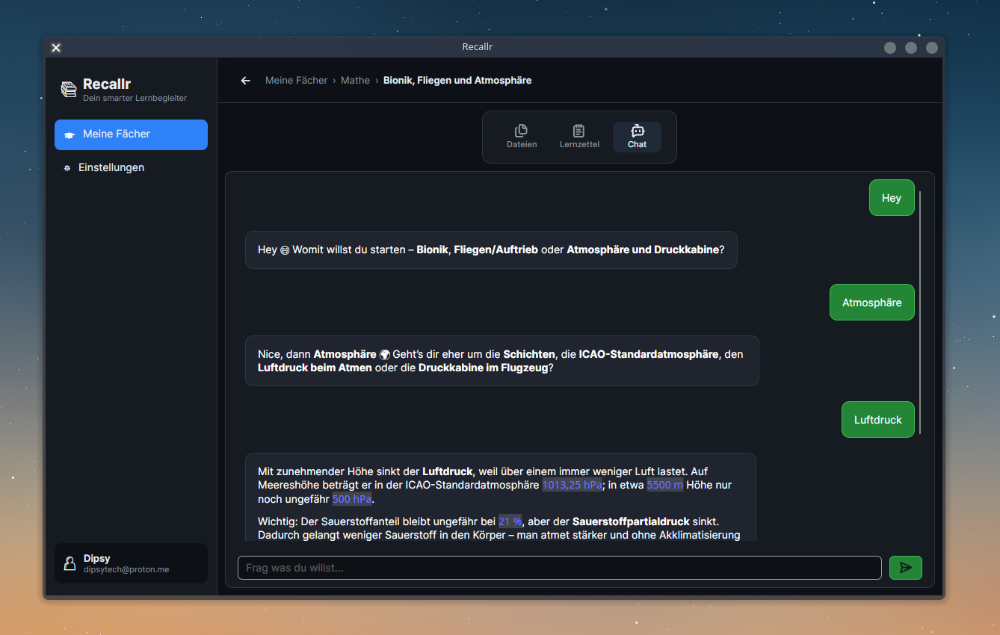
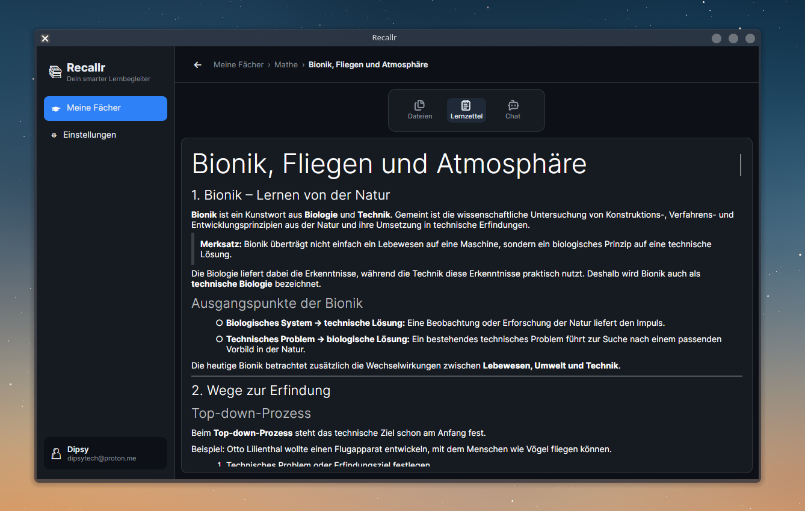
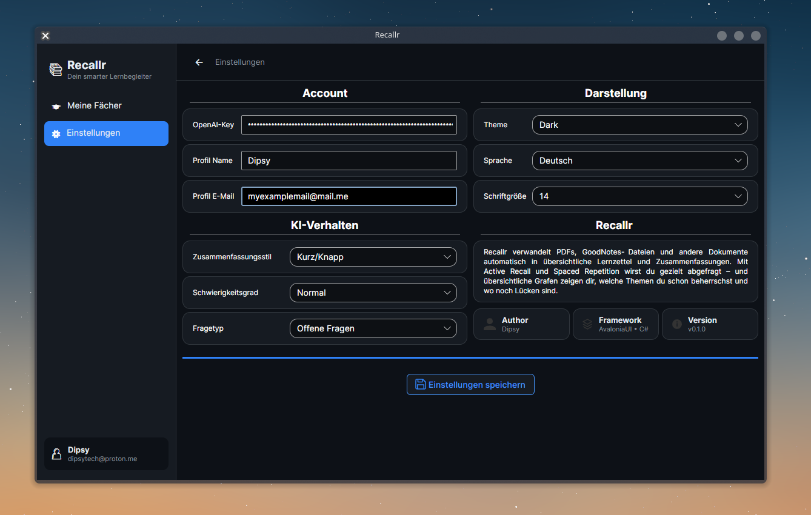

# Recallr


Recallr — turn photos and PDFs into compact study sheets ("Lernzettel") and AI-generated quizzes to practise active recall.

> Status: v0.1.0 — Active development

---

## What is Recallr?

Recallr converts user-uploaded photos and PDFs into structured Lernzettel (study sheets) using an OpenAI-powered pipeline and can generate interactive AI quizzes (chat-style) from that content so users can test and reinforce their knowledge.

Typical workflow:
- Upload photos / PDFs of notes or slides
- Generate a Lernzettel (AI summarizes and formats content)
- Extract title & description (metadata)
- Start an AI-powered chat/quiz to test knowledge based on the Lernzettel

---

## Screenshots
|                       Course Edit                        |                      Learnsheet View                      |
|:--------------------------------------------------------:|:---------------------------------------------------------:|
|     |   |

|                     Learnsheet Chat                      |                       Settings View                       |
|:--------------------------------------------------------:|:---------------------------------------------------------:|
|  |       |

## Key implemented features

These features are implemented in the current codebase:
- Local project layout with a single MainWindow and MVVM navigation (ContentControl swaps views).
- Course & Lernzettel management persisted as JSON in %APPDATA%/Recallr/Config (ClientSettings.json, ClientCourses.json).
- File import for images (.png, .jpg, .jpeg, .webp) and PDFs (FilePicker + PdfSharp page count).
- AI integration (OpenAI SDK) to:
  - Create Lernzettel from uploaded files (images/PDFs sent as file parts)
  - Extract Lernzettel metadata (title + description)
  - Stream chat/quiz responses for an interactive Q&A experience
- Chat history persistence (per-Lernzettel JSON chat logs under %APPDATA%/Recallr/ChatLogs).
- User settings (OpenAI API key, profile name/email, theme, language, font size, summary style, difficulty, question type).
- Theming (light/dark) and Fluent UI styles via Avalonia resources.
- Single-window UI with overlay dialogs (New course overlay) and breadcrumb navigation.

Notes from code:
- OpenAI model is currently hardcoded to `gpt-5.6-luna` in AIService.
- Settings and courses are stored as plain JSON files in the user's ApplicationData folder.

---

## Planned / Upcoming Features

Planned items (not yet implemented in code):
- Knowledge status view for Lernzettel (tracking how well the user knows each topic)
- Encryption of OpenAI API keys stored in the config
- Full multi-language support (German and English; currently defaults to German prompts)
- Ability to select which OpenAI model is used (expose model selection in Settings)
- Adjustable font size for the Lernzettel view (UI control to change font rendering)

---

## Architecture & Tech stack

- UI: Avalonia (MVVM pattern)
- Language / Runtime: C# / .NET 10
- MVVM: CommunityToolkit.Mvvm
- AI: OpenAI .NET SDK (OpenAI.Chat integration)
- Markdown rendering: Markdown.Avalonia
- PDF handling: PDFsharp
- DI: Microsoft.Extensions.DependencyInjection (basic service registration)

Code layout highlights:
- App startup: Program.cs (creates %APPDATA%/Recallr/Config files if missing)
- Views: /Views (CourseView, LearningsheetView, LearningsheetDetailedView, SettingsView)
- ViewModels: /ViewModels (MainViewModel, CourseViewModel, LearningsheetDetailedViewModel, SettingsViewModel)
- Services: /Models/Services (AIService, SettingsService, CoursesService, ChatStorageService, FilePickerService, PdfService)
- Models: /Models/Configuration and /Models/Models

---

## Setup / Build

Prerequisites:
- .NET 10 SDK (or newer)

Restore and run locally:

```bash
# from repository root
dotnet restore
dotnet build
dotnet run --project Recallr.csproj
```

Notes:
- The project references packages in the .csproj (Avalonia 12.1.0, OpenAI 2.12.0, Markdown.Avalonia, LiveChartsCore, PDFsharp, CommunityToolkit.Mvvm).
- No extra database required — app stores JSON files under the OS ApplicationData folder (see FileSystemPaths in source).

---

## Running the app / Quick usage

1. Launch the app (dotnet run or your platform-specific build).
2. Open settings ("Einstellungen") and paste your OpenAI API key into the key field, set profile name/email and preferred theme.
   - Current implementation saves the key in plain JSON at %APPDATA%/Recallr/Config/ClientSettings.json.
3. Create a course ("Neues Fach") and open it.
4. Create a learn sheet ("Neues Lernzettel") and use the file picker to add files.
5. Click "Lernzettel erstellen" to generate the summary. The generated text is saved as learnsheet.txt in the Lernzettel folder.
6. Open the Lernzettel chat to start AI-powered quizzes / active-recall practice. Chat is streamed and saved to per-Lernzettel JSON logs.

Paths used by the app (OS-dependent):
- Settings: %APPDATA%/Recallr/Config/ClientSettings.json
- Courses: %APPDATA%/Recallr/Config/ClientCourses.json
- Course files: %APPDATA%/Recallr/Courses/{courseId}/{learnsheetId}/
- Chat logs: %APPDATA%/Recallr/ChatLogs/{courseId}/{learnsheetId}.json

---

## Contributing

This project is in early, active development (v0.1.0). Contributions, bug reports and feedback are welcome — open an issue or submit a pull request. Prefer small, focused PRs and describe breaking changes clearly.

Before contributing:
- Run dotnet restore and ensure the app builds locally.
- If changing settings storage or secrets handling, include migration notes.

---

## License

This repository includes a LICENSE file: MIT License. See LICENSE for details.

---

If anything in this README is unclear or you'd like the README adjusted (language, example screenshots, additional sections), say which parts to expand and a preferred tone (concise, tutorial, or marketing).